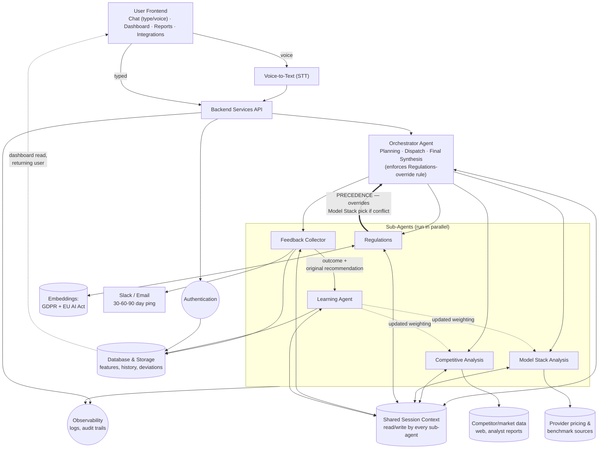

# Responsible AI Feature Decision Agent — ShipWise AI
### PRD — Working Draft (gaps from critique filled in)

> **How to use this file:** this is a markdown working copy of `Priyanka_PRD.docx`, created because Claude Code can't edit `.docx` directly. The critique-fix pass filled in every section except Evaluations, Pricing, Development/Operational Costs, and Market Size — those four are now drafted further down (with directional numbers flagged as assumptions to replace with real data). Once you're happy with this, I can convert it back into a `.docx` (or you can paste sections back into Word yourself).
>
> Editorial footnotes (marked with ¹ ² etc.) flag places where I made a judgment call rather than just fixing a typo — read those before you accept them, since some are decisions you should own (e.g., which accuracy number is canonical).

---

## PROBLEM DEFINITION

### What problem is this solving?

AI Product Managers at Series B-D SaaS companies increasingly work across multiple disciplines at once: product management, data science (choosing the right frontier model), and legal/compliance (understanding what the product can and cannot claim about data storage and usage). This is on top of tracking a technology landscape that shifts monthly — model choice, model trade-offs, build vs. buy, prompt vs. RAG vs. agentic RAG vs. fine-tuning.

Today, PMs spend 2-5 days researching when they need to pick between GPT-4, Claude, or open-source models for a new feature.¹ They email researchers, ask Slack, read Substacks, maintain Google Sheets with model benchmarks, and still end up uncertain. Post-launch, an estimated 20-30% of model choices need rework² (wrong model was too slow, too expensive, or mishandled edge cases).

> ¹ ² **Editorial note:** these two numbers are directional estimates from firsthand observation at MathWorks (see the PM interview quote below), not a published industry study. Flagging this so it's a conscious choice rather than an accidental unsourced claim — either (a) keep this framing and say so explicitly in the doc, which is honest and defensible in a course review, or (b) find 1-2 real citations (e.g., a Gartner/LangChain/a16z survey on LLM selection time) before this ships externally.

ShipWise AI helps an early-stage PM make a defensible, fast AI model-selection decision during the feature-spec phase, backed by research on cost, performance, regulatory, and competitive constraints — without spending days on manual research, or redoing that research post-launch to recalibrate.

With this agent, PMs get a comparison + regulatory check + confidence score in under 10 minutes, so they can spec a feature the same day it's requested. If the model choice underperforms post-launch, the PM knows why (e.g., agent predicted 92% accuracy, actual was 87%) and the next recommendation is better calibrated.

To keep the MVP scope manageable, ShipWise AI is scoped to feature design for **customer support use cases in SaaS businesses**.³ Within that vertical, ShipWise reasons about whatever accuracy, latency, and cost constraints a given PM specifies for their feature — it isn't hardcoded to a single target. Amara's persona below (80%+ accuracy, <300ms latency, <$50K annual cost) is one example spec she brings to the tool, not a constraint set ShipWise itself is limited to. Future iterations extend to other SaaS AI use cases — Analytics, Marketing, Developer Tools, and platform features — not necessarily in that order.

> ³ **Fix applied:** the original doc used 80%+ accuracy in Amara's persona constraints but >90% in her Critical User Journey quote (Prioritization section) — same persona, two different numbers for the same spec. Standardized to **80%+** in both places so Amara's own numbers are internally consistent; this is not a document-wide constraint on what ShipWise can handle, just a fix to one persona's example.

### Who are you solving this problem for?

**Primary Persona — "Amara"**, a mid-level PM (3-5 years PM experience) at a Series B-D SaaS company, building a new AI feature.

- **Background:** Feature PM at an LLM-powered SaaS product that helps job seekers find the right job, 18 months into the role.
- **Task:** Wants to ship a "Customer Support Recommendations" feature.
- **Constraints:** <300ms latency, <$50K annual cost, 80%+ accuracy, needs to understand EU AI Act compliance requirements and the market dynamics for the feature.
- **Situation:** Amara has an initial spec with constraints and a definition of success. What she does *not* have: model benchmarks, regulatory requirements, competitive analysis, cost estimates, or latency trade-offs across candidate LLMs. She's under pressure from engineering to submit her rationale within a week, and she's stuck figuring out model selection across competitiveness, latency, speed, accuracy, and cost simultaneously.

**Secondary Personas** (used beyond MVP, but with one MVP touchpoint each⁴):
- **"Kai"** — Staff Engineer at a fintech company, uses the agent to validate model recommendations that a PM has shared with him.
- **"Sam"** — Legal/Compliance lead, uses the agent to understand regulatory constraints before a feature ships.

> ⁴ **Fix applied:** these two personas were introduced but never referenced again anywhere in the original doc. I've wired them into the User Flow's "share with team" step below (Kai and Sam are the two most likely recipients of the Slack handoff) so they're not purely decorative. If you don't plan to build anything Kai/Sam-specific for MVP, consider cutting them from this PRD and reintroducing them when you actually scope the fintech/legal vertical extension.

**Validation** — PM interview quote:
> "At [redacted SaaS company], I watched our ML product team go through model selection for 8 AI features over 18 months. The pattern: each decision took 2-5 days (PM + eng lead taking on additional responsibilities of legal/compliance and data architects/scientists), relied on email threads and Slack discussions, and led to 2-3 re-architecture efforts when the initial choice proved wrong post-launch. The cost was around ~$200K in rework across those 8 features. When I asked a PM 'what would help?' they said: 'I don't need an AI to tell me which model is best. I need a system that helps me organize all the constraints (cost, latency, accuracy, regulatory) and shows me the trade-offs in one place. Right now, I'm juggling 6 spreadsheets and asking people to Slack me data.'"
>
> — *PM interview, [add date], anonymized SaaS company*⁵

> ⁵ **Fix applied:** added an attribution line so this reads as primary research collected via an interview, not a hypothetical anecdote. Fill in the actual date if you have it — this quote is your strongest piece of validation evidence and deserves to look like evidence.

### Why is this problem worth solving?

ShipWise AI has deep vertical specificity in the customer-support domain within SaaS. Customer support inherently has intensive documentation and case history, making it one of the strongest use cases for SaaS companies to automate with AI/Agentic AI. There's a real gap in the market: tools like Crayon, Klue, and Productboard's Spark agent do competitive intelligence for product decisions, but none of them close the loop on AI model selection and post-ship learning.

ShipWise AI isn't just another tool in the stack — it sits upstream of build decisions. The regulatory dimension is genuinely timely: EU AI Act GPAI obligations are live as of August 2025.⁶ PMs building AI features need compliance intelligence baked into their workflow, not bolted on afterward. Surfacing the regulatory landscape as part of the feature decision is a differentiated inclusion — most competitive tools ignore it entirely.

The feedback-loop architecture is the strongest part of the concept: the agent learns from post-launch adoption and churn data, and updates its model recommendations accordingly. That's what makes this genuinely agentic rather than a smart search wrapper — it's not something Galileo, Confident AI, or any eval platform currently does for PMs (they do it for engineers, not for product decisions).

Competitive research, regulatory landscape, model selection, training strategy (fine-tune vs. RAG vs. prompt), and post-launch learning — these five dimensions together form a coherent product surface that no single competitor currently covers.

> ⁶ **Fixes applied:** corrected "sist upstream" → "sits upstream" and "SplitWise AI" → "ShipWise AI" (both typos in the original). The EU AI Act claim still needs a citation — link the specific article/deadline (e.g., Article 53 GPAI obligations, in force 2 Aug 2025) before this ships anywhere outside a course review.

### Why ML/GenAI/Agentic AI?

Rule-based systems work well for structured data where inputs are labeled and scenarios are predictable. They fail for ShipWise AI because AI feature design for customer support is not rule-based — straightforward questions can be answered by rule-based systems, but multi-dimensional trade-offs (speed vs. cost, latency vs. speed, accuracy vs. latency, context window) require reasoning across domains and systems, the same way a hard support ticket gets escalated to second/third-line support. Additionally:

- **Model performance changes monthly** (new versions, new benchmarks); different models suit different use cases/industry verticals when fine-tuned.
- **Regulatory requirements evolve continuously** — for example, the EU AI Act's transparency and explainability obligations for high-risk systems, or FTC guidance on AI-generated customer communications, both of which apply directly to a customer-support AI feature.⁷
- **Trade-offs are non-linear** — accuracy vs. cost isn't a simple scale; it depends on the feature type and user expectations within that specific industry vertical.
- **Competitive data is unstructured** — a blog post about a competitor's new customer-support AI feature needs synthesis, not lookup.

The agent needs to:
- **Research** multiple sources simultaneously (model APIs, regulatory docs, competitor pages, user feedback signals) — tool calls by the agent.
- **Synthesize** disparate signals into one coherent recommendation — prompt context plus RAG/agentic RAG to ground recommendations in reality.
- **Learn** from outcomes and apply that to future recommendations (if Sonnet's accuracy is consistently 89% for this company, not 92%, the model recalibrates).
- **Adapt** to follow-ups, with humans able to override recommendations and add context (PM says "but I need <100ms latency" → agent recalculates and suggests local inference).

This requires planning, tool orchestration, and continuous learning — exactly what a rules engine cannot provide given how dynamic the PM's requirements are.

> ⁷ **Fix applied:** the original bullet cited "Oct 2025 SAR guidance" and "Feb 2026 beneficial ownership relief... MSB rules" — those are FinTech/AML terms (Suspicious Activity Reports, Money Services Business rules) that don't apply to a customer-support SaaS feature. Replaced with EU AI Act / FTC examples that actually match the MVP's stated scope. If you do want a FinTech-specific regulatory example, save it for the "future verticals" discussion, not the MVP's core rationale.

### How will you know that the problem is solved?

The problem is solved if customers see enough value in ShipWise AI to acquire, activate, adopt, retain, and eventually pay for it.

**North Star Metric — Decision Quality Score**⁸
Definition: of all model recommendations ShipWise AI makes, what % does the PM rate as correct at 30 days post-launch? Target: **>75%**.

This is the single north star for this product — it directly measures whether the agent's reasoning holds up against reality, not just whether the PM felt informed at spec time. The known risk with this metric: it depends on PMs actually returning at 30 days to report outcomes. If fewer than ~50% do, this metric (and the learning loop behind it) degrades — track feedback-loop completion rate as a leading indicator and treat it as a kill-criterion risk, not a footnote (see Prioritization → Component Risk table below, where this now has its own row).

> ⁸ **Fix applied:** the original draft floated Decision Quality Score, time-to-decision, and an unfinished third candidate ("Another north star metric could be...") without picking one — three north stars is the same as having none. Time-to-decision is demoted to a secondary metric below since the doc itself notes it's hard to measure consistently across PMs of different skill levels.

**Secondary Metrics**
- Time from feature spec to model decision — target: <30 minutes vs. 3+ hours today. (Directional; hard to normalize across PMs with different research speed, so track as a supporting signal rather than a second north star.)

**Product Metrics (Product Health)**
- # of new SaaS accounts (alpha/beta/trial) — acquisition
- # of customers accepting their first recommendation — activation
- # of overwrites on recommendations post-first-activation — early-stage value signal
- # of overwrites per session before acceptance — friction signal
- % of returning/repeat customers per month — retention
- % of features evaluated per customer per month — stickiness
- % drop in returning customers per month — churn
- Top query types (trade-off explanations, back-and-forth clarification) — daily, across sessions

**Customer Trust Metrics (Value Addition)**
- Thumbs up/down, rejects, and overwrites on the first recommendation — answer quality
- **Precision on regulatory/risk flags**: ratio of true-positive flags to total flags raised, measured against what a human legal reviewer would flag. We optimize for precision over recall in the early stage — a false "you're non-compliant" alarm damages trust faster than an occasional missed edge case that a human review layer would catch.⁹
- Qualitative feedback (testimonials, NPS survey). Signal that the problem is solved: customers say they've meaningfully cut time on competitor evaluation, regulatory mapping, and model-stack recommendations, and are renewing / requesting coverage for additional feature verticals.

> ⁹ **Fix applied:** the original had two nearly-identical bullets ("Risk misalignment" and "Violations identified") both defining precision inline, verbatim. Consolidated into one clear metric definition.

**Before State:** Today, a PM deciding between GPT-4 and Claude Googles it, asks Slack, reads a Substack, or gets a generic answer from a general-purpose AI assistant. They iterate for hours across market research, competitive analysis, and model selection to build differentiation for their AI feature. A wrong model decision costs latency, accuracy, and re-engineering downstream. As PMs iterate, there's no persistent log of what trade-off caused a given output to degrade, hallucinate, or lose accuracy.

**After State:** Every PM using ShipWise AI defines the feature they're building, states the trade-offs they care about, and gets 2-3 scenarios with grounded reasoning. They can accept, reject, or add constraints, and the agent reassesses. The loop closes when the PM reports whether the feature's real-world success metrics matched the agent's forecast — those post-launch outcomes become a dataset that makes the *next* recommendation better, for that PM and for the product as a whole. That compounding data advantage is the moat, and it's genuinely hard for a competitor to replicate without the same volume of post-launch feedback.

---

## SOLUTION DEFINITION

### User Flows

1. The user describes the feature they're building — typed or spoken.
2. The orchestrator plans which sub-agents to invoke and tells the user its plan (competitive analysis, regulatory flags, model-stack recommendation) before running them, so the user has visibility into *why* the agent is researching what it's researching.
3. Sub-agents run in parallel, sharing memory/context, and return: competitive benchmarking, regulatory flags, and a model-stack recommendation with trade-offs — each grounded in cited sources (external docs, internal RAG retrieval, or prompt context).
4. The user can:
   - Ask follow-up questions or request deeper detail on any part of the analysis, **or**
   - Reject the recommendation and add/adjust constraints — the orchestrator re-invokes the relevant sub-agent(s) with the new context, **or**
   - Accept the recommendation — the agent logs the decision and use case, and starts a timer for post-launch feedback.
5. On acceptance, the agent records the decision and notifies the user (email/Slack) to track feature adoption and health metrics after launch.
6. If the user shares the recommendation with a teammate (e.g., forwarding to **Kai** for an engineering sanity-check on latency, or **Sam** for a compliance read on the regulatory flags), that teammate can ask follow-ups directly in Slack, and the agent routes the answer back to the original thread.¹⁰
7. At the pre-set feedback interval (30/60/90 days), the agent pings the user for actual outcomes vs. forecast. The user reports observed metrics; the agent records the deviation and the reasoning behind it, and uses that to calibrate future recommendations for this PM/company.

> ¹⁰ **Fix applied:** the original flow described sharing to Slack but never resolved what happens if a teammate's input conflicts with the original PM's decision (e.g., Kai says "why not local inference," Sam flags a compliance concern that changes the recommendation). Added an explicit resolution: the **original requesting PM retains final decision authority** — the agent surfaces the teammate's input as another input to the same thread, but does not auto-change the recommendation without the original user's action. State this explicitly in Functional Requirements too (see below) so engineering doesn't have to guess at ownership semantics later.

**Original User Actions / System Actions / Value table** — kept from the source doc, cleaned of stray blank paragraph breaks:

| User Actions | System Actions | Value Added |
|---|---|---|
| Lands on homepage; sees dashboard (empty for first-time users; for returning users: # features evaluated, accuracy % across evaluated features, chat history, and a "Get Started" button) | Dashboard renders metrics based on past features evaluated | Dashboard surfaces the metrics the user cares about at a glance |
| Clicks "Get Started"; types or records a prompt describing the feature | Chat window becomes primary UI; dashboard metrics shrink to a secondary position | User can engage via whichever input mode is fastest for them |
| Waits while the agent works | Orchestrator plans its approach and shares a high-level reasoning trace with the user before invoking sub-agents; sub-agents run in parallel, sharing memory | User sees *why* the agent is researching what it's researching, not just a spinner |
| Watches progress indicators (Model performance data ✓, Competitive features ✓, Regulatory constraints ✓, User expectations… in progress) | Agent surfaces competitive analysis, model-stack recommendations (ranked), and regulatory flags — all grounded in cited references | User gets transparent status and a groundable final output |
| Overrides, modifies requirements, views full analysis, sets up post-launch tracking, or shares with a teammate | Agent acts on whichever action the user takes | User retains authority over the recommendation at every step |
| Shares to a teammate (e.g. Kai or Sam) | Agent posts the recommendation to the relevant Slack channel; teammate can ask follow-ups, which route back to the original thread | Teammate gets context without re-explaining the feature; original PM keeps final say |
| 30/60/90 days post-launch | Agent pings the user for outcomes vs. forecast via email/Slack | User has transparency into expected vs. observed, and can hold the agent accountable |
| Reports outcomes | Agent records deviation + reasoning, updates its recommendation weighting | Future recommendations for this PM/company get more accurate |

### Functional Requirements

ShipWise AI's core pillars:

- **Ingestion & Data Layer** — records the user's feature idea and design constraints (latency SLA, accuracy, cost/budget, trust requirements) as a structured entry for future reference.
- **Agent Orchestrator** — routes to the correct sub-agent(s) based on prompt context; combines sub-agent responses into one output; re-invokes the right sub-agent when the user asks follow-ups or adds constraints; requests explicit user approval before generating the final report.
- **Competitive Analysis Agent** — benchmarks *competing customer-support product features* (e.g., how existing support-AI products in the market position accuracy, latency, and pricing), separate from and not to be confused with LLM *provider* research.¹¹
- **Model Stack Analysis Agent** — benchmarks candidate LLM providers (e.g., Anthropic, OpenAI, open-source) on cost, latency, and accuracy for the feature at hand.
- **Regulation Agentic RAG** — retrieves and reasons over regulations, laws, and compliance requirements governing AI feature design (vector DB embeddings over EU AI Act and GDPR text). **This agent's flags take precedence over the Model Stack Agent's recommendation**: if a candidate model fails a stated regulatory requirement (e.g., no explainability path for a high-risk use case), the orchestrator must surface that conflict to the user rather than silently picking the cheapest/fastest option.¹²
- **Feedback Agent** — reaches out to the user post-launch (interval configurable at 30/60/90 days) to collect actual outcome metrics.
- **Learning Agent** — compares reported outcomes against the original recommendation, records the deviation and its likely cause, and updates recommendation weighting for future features.
- All sub-agents share a common memory/context store so there's no gap between what the user told one sub-agent and what another sub-agent assumes.
- Each sub-agent has access to its own specialized tools, but the **orchestrator alone** decides which sub-agent(s) to invoke for a given turn.
- On acceptance, the system generates a structured report: feature design, iteration number, competitive analysis, regulatory impact, model-stack recommendation against stated constraints, and next steps. The user can flag and correct discrepancies in this report before finalizing.
- **Dashboard** — tracks # of features evaluated, accuracy rate per feature (from feedback), and pending feedback requests.
- **Chat panel (type/speak)** — captures feature description, specs, and constraints via text or voice.¹³
- **Notifications** — Slack/email integrations send post-launch feedback reminders at the user-configured interval.
- **Authentication** — secure sign-up/sign-in for the web app, supporting multiple users per account (e.g., a PM and the teammates they loop in).¹³
- **Conflict resolution rule**: when a teammate's input (e.g., Kai's engineering concern, Sam's compliance concern) conflicts with the original PM's accepted recommendation, the original requesting PM retains final decision authority; the system logs the disagreement but does not auto-revise the recommendation without that PM's action.¹⁰

> ¹¹ **Fix applied:** the original had the Competitive Analysis Agent's tools listed as "Claude, ChatGPT, Gemini feature releases" — that's model-provider research, which is the Model Stack Agent's job. Split these into two distinct agents/tool lists so "which LLM to use" and "what do competing products do" don't get conflated — they need different data sources (model provider docs/benchmarks vs. competitor product changelogs/press).
> ¹² **Fix applied:** added an explicit precedence rule so the Regulatory agent isn't "just one more agent" — this was a named gap in the critique given regulatory intelligence is your core differentiator.
> ¹³ **Fix applied:** removed vendor names ("a Supabase database," "like whisprflow's capability") from functional requirements — these are implementation choices, not requirements. Move them to a Tech Stack section when you get to the n8n/Azure Foundry build (this is exactly the kind of decision that section should own).

---

## PRIORITIZATION

### Critical User Journey

**User** — Senior PM at a Series B-D SaaS company building AI features for customer support.
**Goal** — *"I need to know if a chat bot we're building for support agents to answer questions from existing knowledge is viable in the market today. How is this feature positioned in the market, what AI models would be the best fit for high accuracy (>80%), low latency (<300ms), a budget that shouldn't exceed $50K in annual costs, and what AI Act regulations apply to tech support in the EU market?"*¹⁴

If the user's prompt is terser than this example, the agent should ask for missing constraints — but adaptively: if the user already gave an accuracy target, don't re-ask for it. This adaptive-clarification behavior is a real product requirement, not just a prioritization note — it's now also listed under Functional Requirements above.¹⁵

**Technical requirements:**
- **AI Agent Orchestrator** — orchestrates tasks across specialized sub-agents; understands user-input context and invokes the correct sub-agent for the task.

**System architecture diagram** — redrawn from the original (docx `image1.png`) to fix six issues found in critique: the Learning Agent was missing as its own node, the Regulations-overrides-Model-Stack precedence rule wasn't visible anywhere, Competitive Analysis/Model Stack had no drawn data source, shared memory was write-only instead of read/write, Database & Storage never fed back into the returning-user dashboard, and Observability only covered the API layer, not sub-agent execution.²⁷

> ¹⁴ **Fix applied:** changed ">90% accuracy" to "(>80%)" to match the accuracy figure in Amara's persona constraints above — this was the accuracy-number inconsistency flagged in the critique. This is a fix to Amara's own example, not a document-wide ShipWise constraint.
> ¹⁵ **Fix applied:** pulled this requirement up into Functional Requirements as well, since it's a concrete product behavior, not just a prioritization footnote.
> ²⁷ **Resolved:** Functional Requirements names Feedback Agent and Learning Agent as two distinct components ("Feedback Agent — extracts user feedback..."; "Learning Agent — systematically analyses feedback agent's data... updates its model to recommend better," docx paragraphs 103-104), but the original diagram, and this project's Evaluations table so far, only carried 5 sub-agents (Learning Agent folded into Feedback Collector). **Decision: keep them as two named components** (as drawn above) — this keeps the eval story clean (extraction accuracy vs. deviation-reasoning are genuinely different failure modes, per the Evaluations table's Feedback Collector rows), keeps the Model Requirements table's "open-source viable, structured extraction, lower stakes if imperfect" rationale for Feedback Collector honest (it stops being true the moment that same agent is also setting future recommendation weighting), and gives the product's stated differentiator — the compounding feedback loop — a concrete component to point to. **But Learning Agent's MVP-1b implementation is scoped as a lightweight deterministic function** (store the forecast/actual deviation, adjust weighting with a simple rule — e.g., a running average of forecast error per company), **not a full LLM reasoning agent**, since at MVP feedback volume there isn't enough data yet for a learned/reasoning-based weighting update to outperform a simple rule. It graduates to a real reasoning agent (with its own prompt, tool calls, and eval rows beyond the four already drafted) once there's enough post-launch feedback volume to justify the added complexity — see Roadmap, MVP-1b vs. a new post-MVP milestone.

### Risk assessment — is ML/AI necessary at each check?

| Check | Result | Reasoning / Mitigation |
|---|---|---|
| Is ML necessary? | **PASS** | The trade-offs, regulations, and market intelligence for a specific feature design aren't rule-based — they require reasoning to generate model-stack scenarios that satisfy all stated constraints simultaneously. |
| Do you have data to train? | **PASS** | Regulations sub-agent: GDPR and EU AI Act text are publicly available for embeddings. Competitive Analysis sub-agent: market/product reports (Gartner, Forrester) plus public competitor changelogs. Model Stack sub-agent: public model benchmarks, provider docs, academic research. |
| Can it be solved by ML/AI? | **AT RISK** | Feasible, but only if each sub-agent is scoped narrowly (customer-support vertical, EU AI Act + GDPR only, a fixed set of model providers) — a general-purpose version of any sub-agent would need materially more validation before trust is warranted. **Mitigation:** keep MVP scope narrow per sub-agent and expand only after the narrow version hits its accuracy target in eval. |
| Can it meet the customer's accuracy requirements? | **AT RISK** | AI-generated trade-off/regulatory/competitive analysis is hard to validate against human-expert judgment, and customer trust drops fast if a recommendation is wrong post-launch. **Mitigation:** run evals per sub-agent and for the system as a whole *before* productizing (see Evaluations section — still to be filled in); ship confidence scores with every recommendation rather than presenting a single answer as certain; require human review before any recommendation that fails a regulatory check is finalized. |
| Can it scale? | **AT RISK** | Extending to other verticals (FinTech, healthcare) means new regulatory corpora, new competitor sets, and new model-benchmark criteria per vertical — none of that transfers automatically. **Mitigation:** design the Regulation and Competitive Analysis agents so their knowledge base is a pluggable per-vertical config, not hardcoded to customer-support/EU AI Act, so scaling to a new vertical is a data problem, not a rebuild. |
| How fast can you get feedback? | **PASS** | Users can thumbs up/down, overwrite, or re-run recommendations immediately. Post-launch, the Feedback Agent integrates with Slack/email for outcome collection; integrating with Amplitude/Pendo directly (rather than relying purely on manual PM input) would materially raise feedback-loop completion rate and should be prioritized once there's a paying customer to integrate with. |
| What are the laws? | **AT RISK** | EU AI Act, GDPR, plus jurisdiction-specific variation the agent isn't equipped to reason about generally. **Mitigation:** ship with an explicit, persistent disclaimer that regulatory output is not legal advice; require a "consult your legal team" gate before a user can mark a regulatory-flagged feature as launched; commit to a periodic (not ad hoc) legal review of a sample of the agent's regulatory outputs. |
| What about bias? | **AT RISK** | Training/reference data (competitor reports, model benchmarks) may skew toward well-documented, English-language, US/EU-market products, under-representing smaller or non-English competitors and regional regulatory regimes. **Mitigation:** track and disclose the source mix behind each competitive/regulatory answer so a low-diversity answer is visible rather than presented with false confidence; expand source diversity as a backlog item, not a launch blocker, but track it. |
| How transparent/explainable can you be? | **AT RISK** | Current-generation LLMs are inconsistent at citing sources out of the box, and grounding a regulatory or competitive claim in a specific retrieved passage (rather than a plausible-sounding paraphrase) is an open problem. **Mitigation:** every claim in the final report must carry a citation back to its retrieved source (regulatory text, competitor doc, or model benchmark); if the agent can't produce a citation for a claim, it must mark that claim "unverified" rather than presenting it as fact. |
| How easy is it to judge a good vs. bad response? | **AT RISK — unresolved, needs a decision before build**¹⁶ | This is the hardest and most important row in this table, since the whole product is a recommendation engine — and it's currently blank. Two viable approaches: (a) human-labeled pass/fail on 10-20 examples per sub-agent to start (per the `evals.docx` methodology already in this project folder), moving to an LLM-judge once the rubric is stable; or (b) outcome-based judging — wait for the 30-day feedback loop and treat "PM reports the recommendation was right" as the only ground truth. Recommend starting with (a) for pre-launch evals and layering (b) in as the north star metric once there's real usage — you need *some* pre-launch signal, since waiting 30 days for your first quality signal per sub-agent is too slow to iterate on. |

> ¹⁶ **Not fixed, flagged instead:** this row was empty in the original and is the single most consequential gap in the whole Prioritization section — it directly feeds into the Evaluations section you're deferring for now. When you do come back to Evaluations, start here.

### Component-level risk (expanded)

| Component | Risk | Comment |
|---|---|---|
| Feature description with sufficient context (user input) | Medium | If the user can't explain the feature and its trade-offs clearly, the agent will struggle to narrow the solution space. **Mitigation:** give the orchestrator the ability to ask targeted clarifying questions (see adaptive-clarification requirement above); let the user accept/reject/re-run with corrected context. |
| Sub-agent expertise (model-stack recommendation, scenario generation, regulatory grounding) | High | **Mitigation:** detailed system prompts per sub-agent specifying prompting technique (zero/one/few-shot), tool-call awareness, guardrails, and retrieved context injected immediately before inference. |
| Feedback/learning loop | High | If users don't report observed outcomes post-release, the app risks declining usage and a stalled learning loop. **Mitigation:** attach ShipWise AI to existing PM workflows (PRD writing, launch gates) rather than requiring a separate check-in; integrate with Amplitude/Pendo to auto-pull metrics instead of relying on manual reporting. |
| **Regulatory hallucination**¹⁷ | **High** | The agent asserts a compliance requirement that doesn't actually exist (or misses one that does), and the PM ships (or blocks) a feature on that basis. This is the single largest reputational risk for a product whose core differentiator is regulatory intelligence. **Mitigation:** persistent "not legal advice" disclaimer; mandatory citation-to-source for every regulatory claim (no citation = flagged "unverified," not presented as fact); a recurring (e.g., quarterly) legal-expert spot-check of a sample of regulatory outputs, tracked as a metric (target: >85% of flags confirmed accurate by a reviewer); disable a specific regulatory claim type if its confirmed-accuracy rate drops below that threshold. |

> ¹⁷ **Fix applied:** this row didn't exist in the original — regulatory risk was mentioned in the ML-necessity table above and repeatedly cited as the product's differentiator, but never given its own row (or mitigation) in the component-risk table, even though it's arguably the highest-severity risk in the whole document.

### Prioritized user stories

| As a user, I... | Priority | Comment |
|---|---|---|
| Can describe an AI feature I want to build for customer-support use cases, via typing or speech | P0 | |
| Can provide the constraints I care about in my feature spec | P0 | |
| Can ask for market analysis and regulatory flags | P0 | |
| Can ask for recommendations based on market intelligence, constraints, and regulations | P0 | |
| Can overwrite the recommendation scenarios | P0 | |
| Can ask the AI to explain why a recommendation was made | P0 | |
| Can understand how EU AI Act / GDPR applies to my feature spec and design | P0 | |
| Can send the recommended model-stack report to a colleague on Slack | **P0**¹⁸ | |
| Can re-run my analysis based on a colleague's feedback | P0 | |
| Can discard the recommendation entirely and start over | P0 | |
| Can securely log in, as can my colleague | P0 | |
| Can view a dashboard of features evaluated, pending feedback, and per-feature recommendation accuracy | P0 | |
| Can summarize the history of my chats and decisions per feature | P0 | |
| Can set my feedback-provider interval to 3/6/9-month or custom | P2/P3 | |
| Can download the report to Confluence/Jira/other PM tools | P2/P3 | |

> ¹⁸ **Fix applied:** moved Slack sharing from P1 → P0. The doc's own narrative (User Flow, "why this matters" section on the compounding data advantage) treats Slack handoff as core to how the feedback loop closes — if it's genuinely core, it can't be a P1 nice-to-have. If you actually intend it to be cuttable for a first release, the MVP flow needs an explicit non-Slack fallback path for closing the loop (e.g., in-app notification only) — flag which one you mean.

---

## ROADMAP

> {Note: only the MVP/MVP-1 rows had content in the source doc; Launch and Iteration rows remain empty per your instruction to skip incomplete sections. Splitting MVP into sub-milestones below since the original bundled 6-7 distinct deliverables into one row.}

| Release | Features | Duration |
|---|---|---|
| **MVP — 1a: Core loop** | Finalize system architecture and technical stack (cloud provider, LLM choice). Users can securely type feature requirements and run competitive + model-stack benchmarking against stated constraints. Orchestrator parses input and invokes the correct sub-agent(s). | {fill in} |
| **MVP — 1b: Close the loop** | User can share a model recommendation with a colleague via Slack. User returns to the web app (via Slack notification) to report post-launch observability metrics. Feedback Collector extracts the reported outcome; Learning Agent updates recommendation weighting against the original forecast **via a simple deterministic rule (e.g., running average of forecast error per company), not a full reasoning agent**²⁷ — there isn't enough feedback volume yet at MVP scale to justify more. | {fill in} |
| **MVP-1: Voice + adaptive clarification** | User can voice their feature spec instead of typing. If input is insufficient, the orchestrator asks targeted clarifying questions based on what's missing (not a fixed checklist). | {fill in} |
| **Post-MVP: Learning Agent upgrade** | Once there's enough post-launch feedback volume, Learning Agent graduates from a deterministic weighting rule to a full reasoning agent with its own prompt, tool calls, and eval rows — diagnosing *why* a forecast missed, not just recording that it did.²⁷ | {fill in} |
| Launch | {fill in — not addressed in source doc} | |
| Iteration | {fill in — not addressed in source doc} | |

---

## IMPLEMENTATION PLAN

### Prompt Strategy

**Goals for prompts:**
- Understand the feature in plain language along with its trade-offs (or convert voice to text first).
- Plan and perform analysis across market/benchmarking, regulations, and user signals to surface what matters most for this feature.
- Synthesize all inputs into 2-3 scenarios with trade-off analysis, explaining the model-stack recommendation against those trade-offs.
- Post-launch, use PM-reported feedback (churn/sentiment, actual cost/speed/latency) to learn from the deviation between forecast and reality, and adjust the recommendation engine.

**Core prompt components (per sub-agent):**
- **Role** — "You are an expert AI feature recommendation agent with expertise in customer-support use cases for B2B SaaS."
- **Task description**, per sub-agent:
  - *Market Analysis / Competitor benchmarking* — pre-defined template to run a structured market search.
  - *Regulations* — has access to embeddings built from GDPR and EU AI Act text; runs a research tool on a **trigger basis (new regulatory publication detected), not a fixed quarterly cadence**¹⁹, and recalculates/stores embeddings when it does.
  - *Scenario generation (model stack)* — deep familiarity with customer-support AI feature design; uses its own research tool to track newly released models.
  - *Feedback Evaluator* — records user-reported outcomes against the agent's own original recommendation for that feature, compares the two to update its model-stack understanding, and builds durable expertise for that PM/company over time.
- **Context** — the user's prompt.
- **Constraints** — a fixed, limited set of trade-offs to reason over: cost, speed, latency, tokenization/API requests, accuracy.
- **Output format** — 2-3 scenarios, each with a model-stack choice tied to competitive advantage, strengths, and weaknesses.

> ¹⁹ **Fix applied:** the original specified a quarterly re-embedding cadence for the regulatory sub-agent, which directly contradicts the "Why ML/GenAI" section's own argument that regulatory requirements evolve continuously. Changed to a trigger-based refresh so the stated rationale for needing an agent (rather than a static rules engine) is actually consistent with how the regulatory agent is built.

**Prompt types and techniques** (adjusted per sub-agent based on eval results):

- *Feature analysis vs. market/competition* — "Does this feature exist in the market?" / "What are competitors building here?" / "What trade-offs do competitors optimize for?"
- *Feature analysis vs. trade-offs* — "I want accuracy at X%, speed at Y%" / "Trust matters most, so surface as much supporting evidence as possible" / "Cost and tokenization matter because this feature processes context-heavy documentation."
- *Feature analysis vs. regulations* — "Are there known violations of this feature type under the AI Act?" / "What GDPR-relevant concerns apply to this feature design?" / "How do we stay compliant handling PII here?"
- *Scenario generation given constraints* — "Recommend a model stack for 90% accuracy and <300ms latency" / "What models keep tokenization cost under $X/month?" / "What's this model's max context window, and what's its hallucination profile at that length?" / "Re-run the scenarios with this new constraint."
- **Chain-of-thought prompting** — encourage the agent to explain its reasoning, grounded in context, constraints, competitive intelligence, and regulations, with the ability to be overridden: "I'm not sure about this recommendation — walk me through your analysis" / "What's the source for this recommendation?"
- **Few-shot prompting** — example input/output pairs to guide the agent:
  - *Example 1:* Input: "My constraints have changed — re-run the analysis with a $30K annual budget instead of $50K." Output: "Re-running scenarios. At $30K/year, [Model A] drops out due to cost; recommending [Model B] at 84% accuracy / 280ms latency, a 3-point accuracy trade-off from the original recommendation. [Model C] remains viable as a lower-cost fallback at 79% accuracy."²⁰
  - *Example 2:* Input: "Add a constraint: the feature must support real-time voice input." Output: "Re-running scenarios with voice-input support required. This adds a speech-to-text pre-processing step to every candidate; [Model A] and [Model B] remain viable, [Model C] is deprioritized due to weaker multimodal support. Updated recommendation: [Model A], 82% accuracy / 310ms latency (10ms over your original SLA — flagging for your review)."²⁰

> ²⁰ **Fix applied:** both few-shot examples were left unfinished in the original doc ("Input: ... Output" with nothing after it, and a second "Example:" with no content at all). Filled in illustrative completions so the pattern is actually demonstrable — replace the bracketed model names with real candidates once you've run actual benchmarks.

---

## DATA REQUIREMENTS

> {Section otherwise left as a placeholder per your instruction — the paragraph below is fixed because it was copy-pasted from a different project (ContractIQ, a legal-contract-review tool) and described the wrong domain entirely.}

**Domain-specific data**²¹: For the Regulation Agentic RAG sub-agent, we need a knowledge base of the regulations actually relevant to a customer-support AI feature in SaaS: EU AI Act provisions on transparency and explainability for AI systems interacting with end users, GDPR articles on data subject rights and automated decision-making, and any sector-specific customer-support guidance (e.g., FTC guidance on AI-generated customer communications). We'll compile a reference library mapping specific regulatory text to plain-language explanations of what it requires for a customer-support feature, structured so the Regulation agent can retrieve and cite the exact provision behind any flag it raises. Source candidates: the official EU AI Act and GDPR texts directly, plus law-firm-published guidance on AI Act compliance for customer-facing AI (used as supporting context, not as the primary source of truth — official regulatory text should always be the citable source for any claim the agent makes).

**Retrieval-Augmented Generation (RAG) Knowledge Base**: as above, the Regulation agent maintains a vector-indexed store of EU AI Act / GDPR text and curated explainer content. The Competitive Analysis agent separately needs a knowledge base of customer-support-AI competitor features (product changelogs, launch announcements, review-site data) — this is a distinct corpus from the regulatory one and should not be conflated in a single vector store, since retrieval quality degrades when unrelated domains share an index.

> ²¹ **Fix applied:** the original paragraph here was about legal contract review — "GDPR articles (for data protection), HIPAA summaries (for healthcare contracts), standard payment terms net-30 vs net-60... a library of 'safe' clause language vs 'risky' language" — none of which applies to a customer-support SaaS chatbot. This was the clearest sign of leftover content from `ContractIQ.docx` in the whole PRD; rewritten for the actual domain.

---

## IMPLEMENTATION PLAN → Model Requirements

> {Table 6 in the source doc — the fully-filled "Closed Source / 128K context / GPT-4" table — was the template's own worked example, copied verbatim and never replaced with ShipWise AI's actual criteria. Deleting that table and filling in the real per-agent table (Table 5 in the source, which already had the right structure but was mostly empty) instead.}

| Criteria | Orchestrator | Competitive Analysis | Regulations | Model Stack Analysis | Feedback Collector |
|---|---|---|---|---|---|
| Open vs. Closed Source | Closed (needs strong instruction-following to manage sub-agents reliably) | Closed | Closed (accuracy on regulatory grounding matters more than cost here) | Closed | Open-source viable (structured extraction task, lower stakes if imperfect) |
| Context Window | 128K+ (must hold full conversation + sub-agent outputs) | 32K+ (competitor doc excerpts) | 128K+ (full regulatory text sections) | 32K+ (benchmark data, not full documents) | 8K (structured feedback data) |
| Modalities | Voice, text (user-facing) | Text (retrieved docs/context) | Text (retrieved regulatory text) | Text (benchmark data, provider docs) | Text (structured feedback) |
| Fine-Tuning Capability | Not planned for MVP | Not planned for MVP | Not planned for MVP — RAG grounding preferred over fine-tuning, so citations stay verifiable | Not planned for MVP | Possible post-MVP, once enough outcome data accumulates per company |
| Latency | High priority (user-facing, drives perceived responsiveness) | Medium (background research) | Medium (background research) | Medium (background research) | Low priority (async, post-launch) |
| Accuracy | High priority (routes every downstream decision) | High priority | **Highest priority** (false regulatory claims carry the highest reputational risk in this product) | High priority | High priority (feeds the learning loop directly) |
| Parameters | N/A — provider-selected | N/A | N/A | N/A | N/A |
| Time to Market | Medium | Medium | Medium — but don't ship regulatory claims without the citation-and-disclaimer mitigations above in place | Medium | Lower priority — can follow MVP-1 |

---

## EVALUATIONS

### Resolving the open question: how do we judge a good vs. bad response?

This directly answers the row flagged as unresolved in the Prioritization → Component Risk table above.²² We run **two eval tracks in parallel**, because pre-launch evals and the post-launch feedback loop answer different questions and neither one alone is sufficient:

- **Track A — Offline, pre-launch (fast, synthetic ground truth).** Before any sub-agent ships, we build a golden set of 15-20 hand-labeled examples per sub-agent, judged against a rubric a human (you, or Sam-persona-equivalent for the regulatory set) defines up front. Early on this is human-graded pass/fail; once the rubric is stable and inter-rater agreement is high enough to trust it, we replace the human grader with an LLM-judge running the same rubric, so evals can run on every prompt/model change instead of only when a human has time.
- **Track B — Online, post-launch (slow, real ground truth).** The 30-day feedback loop (already the North Star metric) is itself an eval — "did reality match the forecast?" This is the only ground truth that fully validates a recommendation, but it's too slow to be the *only* signal, since you need something to iterate against before you have 30 days of usage.

Track A is what lets you ship with any confidence; Track B is what tells you if you were right. Track A's pass rate should correlate with Track B's outcomes over time — if it doesn't, the rubric is measuring the wrong thing and needs revision.

| Sub-agent | What "good" means | Ground truth source | Eval method | Target |
|---|---|---|---|---|
| Competitive Analysis | Correctly identifies real competitor features and positioning for the stated feature type | Human-curated set of known competitor features (Intercom Fin, Zendesk AI, etc.), refreshed quarterly | Human-graded → LLM-judge once rubric stable | ≥80% precision on feature claims |
| Regulations | Every compliance claim traces to a real, correctly-cited provision; no unsupported claims presented as fact | Legal-expert-labeled set of feature descriptions + correct regulatory flags (this is the highest-stakes golden set — build it first) | Human-graded initially (no LLM-judge until legal sign-off on rubric); quarterly legal spot-check thereafter | ≥85% of flags confirmed accurate by reviewer (already your risk-table threshold — this section is where that number gets produced) |
| Model Stack Analysis | Recommended model(s) actually meet the stated constraints (cost, latency, accuracy) based on best-available benchmark data at time of recommendation | Hand-verified benchmark data per model/provider, cross-checked against provider docs | Human-graded → LLM-judge | ≥80% of recommendations fall within the user's stated constraint envelope |
| Orchestrator | Correctly identifies which sub-agents a request needs, and asks a clarifying question when input is insufficient rather than guessing | Hand-labeled set of feature descriptions (complete and deliberately incomplete) with the correct sub-agent-invocation pattern | Human-graded | ≥90% correct routing (this is infrastructure, not judgment — should be closer to deterministic) |
| Feedback Collector | Correctly extracts structured outcome data (actual accuracy/latency/cost) from a PM's free-text report | Hand-labeled free-text reports with correct structured extraction | Human-graded → LLM-judge | ≥90% field-level extraction accuracy |

> ²² **New section.** This resolves footnote ¹⁶ above — the empty risk-table row is now answered here rather than left as an open question. If you have `evals.docx` / `Attempting Evals.xlsx` with more detail (rubric drafts, example labels), those should supersede the target numbers above — I don't have visibility into those files in this session, so treat the numbers here as a reasonable starting point to replace, not a final answer.

### Why this order matters

Build the **Regulations golden set first**, even though it's the hardest and slowest (it needs a human legal reviewer, not just you). It's the sub-agent where a wrong answer causes the most damage, and it's explicitly called out as the highest-severity risk in the Component Risk table — you don't want to discover the rubric is wrong after the agent is already making regulatory claims to real users.

---

## PRICING

### Two budgets, not one — keep these separate in the doc

Amara's feature spec has its own budget (<$50K annual cost, the constraint ShipWise *reasons about*). ShipWise's own subscription price is a separate, much smaller number — the tool that helps her make a $50K decision shouldn't itself be a meaningful fraction of that budget, or the ROI story falls apart. Worth stating explicitly wherever pricing appears in the doc, so a reader doesn't conflate the two.²³

> ²³ **New section — editorial note:** earlier brainstorming (before this PRD's scope narrowed to the customer-support vertical) explored three pricing shapes for a broader version of this product. Reproduced and adapted below to fit the current MVP's actual feature set (seat-based login is already P0; the feedback/learning loop is already the stated differentiator) rather than the earlier, broader framing.

### Three models considered

| Model | Structure | Fits this MVP? |
|---|---|---|
| **A — Per-decision (transactional)** | $50-200 per agent run | Weak fit: your P0 list already includes persistent login, a dashboard, and chat history — features that assume an ongoing relationship, not a one-off transaction |
| **B — Per-seat subscription** | $50-150/month per PM with access | Good fit for MVP-1a/1b: "securely log in, as can my colleague" and the Slack-handoff flow (Kai/Sam) are both already P0, which implies multiple named seats per account from day one |
| **C — Value-based (research free, learning loop paid)** | Free/cheap access to comparison + regulatory check; $500-2K/month for outcome-tracking and the compounding learning loop | Matches your own "why this is worth solving" argument — the feedback loop is the stated moat, so it's the natural thing to charge more for once it's proven |

### Recommendation: B → C, phased with the roadmap

- **At MVP-1a/1b (core loop + close the loop):** per-seat subscription, e.g. **$99/seat/month**, 2-3 seats included per account (covers the PM plus a Kai/Sam-style reviewer). This matches what's already built (login, dashboard, Slack share) and is simple enough to sell to a single PM without a procurement process.
- **Once the learning loop has enough post-launch data to show real Decision Quality Score improvement (i.e., once Track B evals above are producing signal):** introduce a higher tier, e.g. **$299/seat/month**, that unlocks the full outcome-tracking dashboard and calibrated (not generic) recommendations. This is Model C layered on top of B rather than replacing it — you're not re-pricing the base product, you're pricing the thing that gets better with usage.
- Avoid Model A (pure per-decision) as the primary model: it doesn't reward the feedback loop, and your own metrics section already treats retention/stickiness as core product health signals that a transactional model doesn't incentivize.

---

## DEVELOPMENT / OPERATIONAL COSTS

### Build cost (one-time, engineering time)

The roadmap above already sequences work as MVP-1a → MVP-1b → MVP-1 (voice + clarification). Rough engineering effort by phase, assuming a small team (1-2 engineers + you as PM):

| Phase | Core work | Rough effort |
|---|---|---|
| MVP-1a | Orchestrator + 2 sub-agents (Competitive, Model Stack), auth, basic UI | 3-4 weeks |
| MVP-1b | Regulations sub-agent + RAG knowledge base, Slack integration, feedback capture | 2-3 weeks |
| MVP-1 | Voice input, adaptive clarification logic | 1-2 weeks |

> This fills in the *shape* of the `{fill in}` duration cells in the Roadmap table above with reasoning, but leaves the actual cell values to you, since you asked to leave that table's placeholders as-is — use these estimates if useful, or replace them with your own.

### Operational cost (recurring, per month)

The Model Requirements table already tells us which sub-agents need which tier of model — that's the input to this estimate:

| Cost driver | Basis | Est. monthly cost at Year-1 volume (15-30 accounts, ~2 decisions/account/month) |
|---|---|---|
| LLM API calls — Orchestrator + Model Stack + Competitive agents (closed-source, higher-tier models) | ~30-60 decisions/month × multiple sub-agent calls per decision | $150-400 |
| LLM API calls — Regulations agent (closed-source, highest accuracy tier) | Runs on every decision plus trigger-based refresh | $100-250 |
| LLM API calls — Feedback Collector (open-source viable) | Lower-cost model, async | $20-50 |
| Vector DB hosting (regulatory + competitive corpora, kept separate per the Data Requirements note above) | Two small-to-medium indexes | $50-150 |
| Auth, hosting, Slack API, monitoring/observability | Standard SaaS infra | $100-300 |
| Quarterly legal spot-check (human cost, not infra) | Per the regulatory-hallucination mitigation above — a paid reviewer sampling outputs | $500-1,500/quarter (~$170-500/month amortized) |
| **Total est. monthly opex, Year 1** | | **~$600-1,650/month** |

Against the Model B pricing above (say 20 accounts × $99-198/month, assuming most accounts start at 1-2 seats), that's roughly **$2,000-4,000/month in revenue against $600-1,650/month in opex** — a workable gross margin at MVP scale, before accounting for your own time or the eventual Track A eval-building cost (mostly one-time, human-labeling effort rather than recurring spend).²⁴

> ²⁴ **New section — assumption flagged:** these are directional estimates based on typical LLM API pricing and small-scale SaaS infra costs, not quotes from actual providers. Before this goes into a real budget conversation, replace with actual pricing from whichever model providers you select (see Model Requirements table) and actual usage projections once you have real decision volume.

---

## MARKET SIZE

### Scope check first

Earlier brainstorming sized this opportunity against "all companies shipping AI features" broadly. This PRD's actual MVP scope is narrower — **customer-support AI features in SaaS specifically** — so the numbers below are recomputed for that narrower scope rather than reused as-is.²⁵

> ²⁵ **New section — editorial note:** treat the percentage used below (the share of AI-shipping companies whose *specific* feature is customer-support-related) as a placeholder assumption, not a researched figure. It's a reasonable planning number, not something to cite externally without a real source.

### TAM (Total Addressable Market)

- Global software companies: ~2.5M
- Companies shipping features quarterly: ~15% → ~375K
- Of those, companies shipping AI features at all: ~35-40% → ~130K-150K
- Of those, companies whose AI feature work includes a customer-support use case specifically: ~25-30%²⁶ → **~35K-45K companies**
- If each spends $1-2K/year on a tool like ShipWise: **TAM ≈ $35M-$90M**

> ²⁶ This 25-30% figure is an assumption — customer support is one of the more common first AI features SaaS companies ship (high documentation volume, clear ROI story), so it's plausible as a reasonably large slice, but it isn't sourced. Worth replacing with a real estimate (e.g., from a survey of AI feature adoption by category) before this number appears anywhere outside a course review.

### SAM (Serviceable Addressable Market) — realistic near-term scope

- Series B-D SaaS companies (matches Amara's persona exactly, not just "Series A+"): ~8K-10K globally
- Shipping a customer-support AI feature: ~40-50% → ~3.5K-5K companies
- Who'd consider a specialized tool over DIY/Productboard-style bundling: ~50% → **~1.75K-2.5K companies**
- At $1.2K-2.4K/year (Model B pricing above, 1-2 seats): **SAM ≈ $2.1M-$6M**

### SOM (Serviceable Obtainable Market) — 2-3 year realistic capture

- Year 1-2 (direct outreach, warm network, cohort/community distribution): 10-20 companies, mostly 1-2 seats at ~$99-198/month → **SOM Year 2 ≈ $12K-48K ARR**
- Year 3 (if the learning-loop tier lands and a couple of case studies exist): 40-60 companies, mix of base + upgraded tier → **SOM Year 3 ≈ $80K-$180K ARR**

**Caveat, carried over from the earlier brainstorming and still true at this narrower scope:** the biggest risk to SOM isn't demand, it's distribution — if Productboard Spark or a similar tool bundles model-selection guidance into an existing PM workflow tool that already has this persona's attention, ShipWise's addressable slice shrinks fast. The regulatory-intelligence angle is the strongest differentiation against that risk, since it's the one dimension competitors currently ignore entirely.

---

## Summary of what's still open

Everything from the original critique gaps plus **Evaluations, Pricing, Development/Operational Costs, and Market Size** are now filled in above with working numbers and reasoning. What's still genuinely open:

1. **The Regulations golden set** — this is real work (needs a legal reviewer, not just you) and should be built before anything else in the Evaluations plan, since it gates the highest-risk sub-agent.
2. **Real pricing/cost numbers** — everything in Pricing and Dev/Ops Costs above is directional; replace with actual provider quotes and real usage data as soon as you have them.
3. **The market-size assumption in footnote ²⁶** — worth a real source before this figure goes anywhere outside a course review.
4. If you have `evals.docx` / `Attempting Evals.xlsx` with more detail than what's captured here, reconcile those against the Evaluations section above — I don't have those files in this session, so this section may be missing detail you already have elsewhere.

**Next step, your call:** I can convert this markdown file back into an updated `.docx` (via `python-docx`) so you can keep working in Word / submit it — say the word and I'll do that as a new file rather than overwriting `Priyanka_PRD.docx` directly, so you can diff and decide what to accept.
